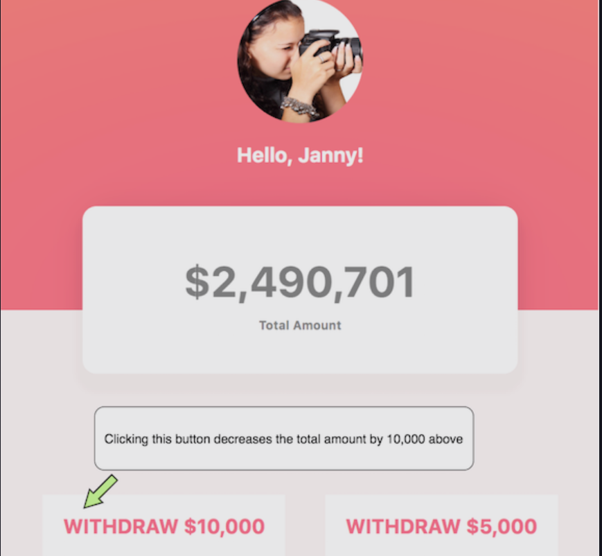

In the exercise files, I have set up a simple ReactJS application that models a user’s bank application.

Have a good look at the mockup. In addition to the the user being able to view their total balance, they can also perform withdrawal actions

The name and balance of the user are stored in the application state.

There are two things you need to do.

(i) Refactor the App’s state to be managed solely by Redux.

(ii) Handle the withdrawal actions to actually deplete the user’s balance i.e on clicking the buttons, the balance reduces.

NB: you must do this via Redux only.

## Running React on Repl.it

[React](https://reactjs.org/) is a popular JavaScript library for building user interfaces.

[Vite](https://vitejs.dev/) is a blazing fast frontend build tool that includes features like Hot Module Reloading (HMR), optimized builds, and TypeScript support out of the box.

Using the two in conjunction is one of the fastest ways to build a web app.

### Getting Started
- Hit run
- Edit [App.jsx](#src/App.jsx) and watch it live update!

By default, Replit runs the `dev` script, but you can configure it by changing the `run` field in the `.replit` file.